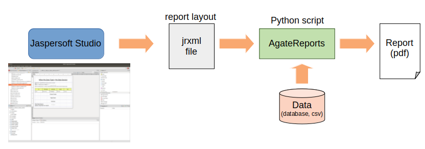

AgateReports

Pure Python engine to generate reports from JasperReports jrxml file.
==============================================================================

Introduction
------------
AgateReports is a pure Python tool to generate reports without extensive coding.
It currently relies on Jaspersoft Studio `<https://sourceforge.net/projects/jasperstudio/>`_ to graphically position reporting elements on a report layout.

This package aims to be a solution to following users:

- Python developers who want to create a report using GUI tool.
- Users who want to modify existing reports without programming.

Differences with JasperReports
------------------------------
- AgateReports use different components than JasperReports and there are minor differences. AgateReports components are based on modules such as ReportLab that are available in Python
- AgateReports ia able to use .ttc fonts
- Additional components available in Python are added. Currently, jrxml file must manually be edited to use these components. Furthermore, since JasperReports do not support these components, edited jrxml file can no longer be edited with Jaspersoft Studio. There is a plan to fork Jaspersoft Studio to support Python language syntax and these components.

Current Restrictions
--------------------
- AgateReports is still in initial development phase and does not provide all of JasperReports features.
- Patterns, format, and Java classes specified in jrxml file need to be changed to Python equivalent.
  For example, "Current Date" needs to be converted from "new java.util.Date()" to "datatime.datetime.now()"
- Currently, only MySQL, Postgresql, and csv file are supported as a datasource
- Performance is slow for large data source.

Requirements
------------
Python3.6 or above
ReportLab
Pillow
MySQL Connector/Python
psycopg2

Installation
----------------
AgateReports requires Pillow. If Pillow is not already installed, please install it with the following command.
::

    pip install Pillow

AgateReports can be installed by the following command:
::

    pip install agatereports

Getting Started
----------------
Please refer to the following github project for full documentation.
https://github.com/ozawa-hi/agatereports

`demos directory <https://github.com/ozawa-hi/agatereports/tree/master/demos/README.rst>`_ contains samples of jrxml files and Python scripts on how to use AgateReports.

Usage Sample
---------------
.. code-block:: python

    from agatereports.adapters import MysqlAdapter
    from agatereports.basic_report import BasicReport

    import logging
    logger = logging.getLogger(__name__)

    def datasource_mysql_sample():
        """
        MySQL data source sample.

        WARNING: Before running this sample, schema 'agatereports' must be create and populated.
        Run scripts in directory 'agatereports/tests/database/mysql' to create and populated database tables.

        CAUTION: Edit values of 'host' and 'port' to those in your environment.
         """
        logger.info('running datasource mysql sample')
        jrxml_filename = './jrxml/datasource_mysql.jrxml'  # input jrxml filename
        output_filename = './output/datasource_mysql.pdf'  # output pdf filename

        # MySQL datasource
        config = {'host': 'localhost', 'port': '3306', 'user': 'python', 'password': 'python', 'database': 'agatereports'}
        data_source = MysqlAdapter(**config)

        pdf_page = BasicReport(jrxml_filename=jrxml_filename, output_filename=output_filename, data_source=data_source)
        pdf_page.generate_report()

    if __name__ == '__main__':
        datasource_mysql_sample()

END
